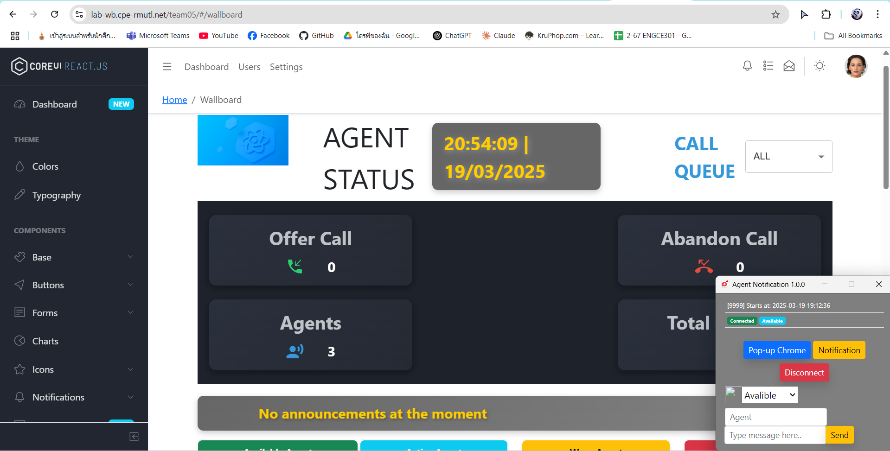
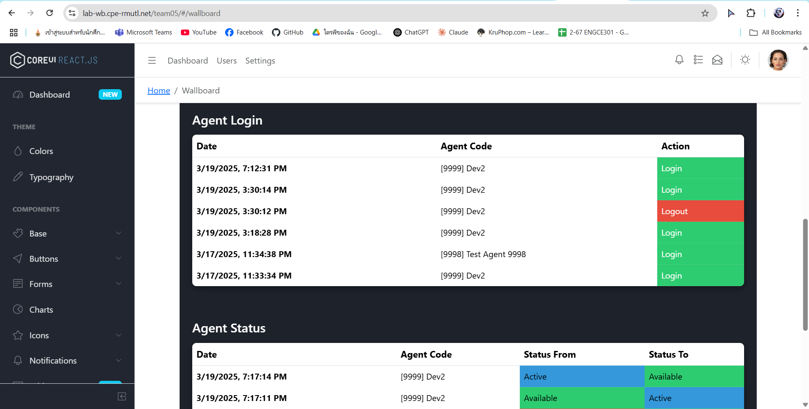
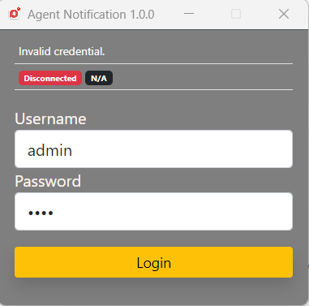
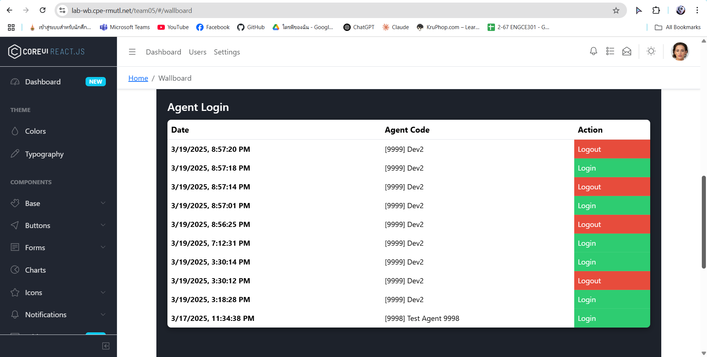
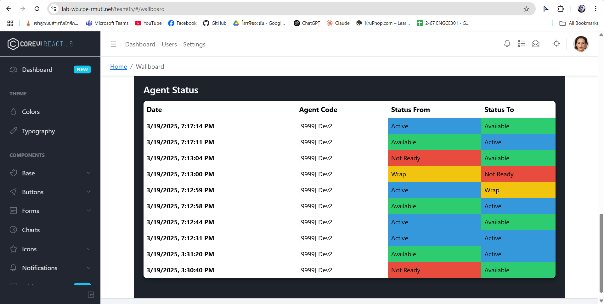
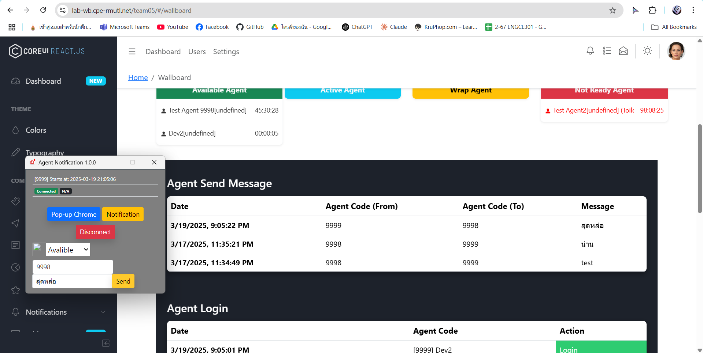

# ENGCE301_Final_team05
This our Solution for Term Project in ENGCE301

### Overview

### R1.1

### R1.2, R2.2

### R1.3, R2.2

### R1.4, R2.3

## **DFD**

## **ER Diagram**

## **Activity Flow Diagram**

## **Test Case**

## **Test Case (Agent Notification)**
| Test Section | Test Description | Test Step | Test Result |
|----------|----------|----------| ----------| 
| R 1.1| Agent สามารถ Login โดยใช้ Password ได้ โดยถ้า Password ผิดจะไม่สามารถ login ได้|1.กรอก Username/password2.กดปุ่ม Login | รหัสถูกจะเข้าสู่ระบบได้ รหัสผิดจะเข้าสู่ระบบไม่ได้ |
|R 1.2|สามารถเก็บประวัติการ login และ logout ได้ ในรูปแบบของวันเวลาที่ Login/Logout|ทดสอบการ Login-Logout เเละดูผลการทดสอบผ่านเว็บ|เเสดงผลประวัติการ login/logout , วันเเละเวลาที่เข้า-ออก ของ Agent บนเว็บ|
|R 1.3|สามารถเก็บประวัติการเปลี่ยนสถานะเวลาเริ่มต้นและสิ้นสุดแต่ละสถานะได้|ทดสอบโดยการส่ง Request เพื่ออัพเดทสถานะของ Agent|เเสดงผลการเปลี่ยนสถานะของ Agent บนเว็บ|
|R 1.4|สามารถเก็บประวัติการพูดคุยของแต่ละ Agent ได้|ทดสอบการส่งข้อความจาก Agent หนึ่งไปยังอีก Agent หนึ่ง และบันทึกข้อความนั้นผ่าน API|มีการเเสดงประวัติการส่งข้อความของ Agent , รายชื่อผู้ส่ง-รับ บนเว็บ|
## **Test Case (Agent Wallboard)**
| Test Section | Test Description | Test Step | Test Result |
|----------|----------|----------| ----------|
|R 2.1|สามารถแสดง Banner ที่ wallboard รวมทุก Agent ได้|ตรวจสอบ route /wallboard |มี Banner เเสดงสถานะการทำงานของ Agent|
|R 2.2|สามารถแสดงประวัติการ login logout และการเปลี่ยนสถานะของแต่ละ Agent ได้|ทดสอบการ Login - Logout ของ Agent ผ่าน agent-notification|มีการเเสดงประวัติการเข้า-ออก ของ Agent |
|R 2.3|สามารถเเสดงประวัติการพูดคุยของเเต่ละ Agent ได้|ทดสอบส่ง message จาก Agent สู่ Agent หนึ่ง ผ่าน agent-notification|มีการเเสดงประวัติการส่งข้อความของ Agent , รายชื่อผู้ส่ง-รับ |

## **API Specification**

Link to API Specification Documentation: [This Link](./docs/api/README.md).

## Our Team
- นายสรยุทธ  จาปัญญะ 65543206081-3
- นายปิยภูมิ บุญนาค 65543206070-6
- นายทินภัทร แก้วชมภู 65543206014-4
- นายเมธาวี วรรณารักษ์65543206076-3
